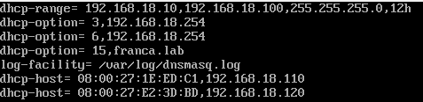

# DHCP

O DHCP é um protocolo de rede utilizado para atribuir dinamicamente configurações de rede a dispositivos quando eles se conectam a uma rede. Além do endereço IP, o DHCP fornece informações como o endereço do gateway padrão.

## Instalação

Utilizei o Linux Alpine como servidor para um cliente Windows.

O comando utilizado foi `apk add dnsmasq`.

## Configuração

Incluir o(s) nome(s) e o conteúdo do(s) arquivo(s) de configuração.

- Distribuir um intervalo (*range* em inglês) de endereços IP; (15 pontos)
- Reservar 2 endereços (IP fixo) fora do intervalo do item anterior. (5 pontos)

---------------------------------------------------------------------------------

Configurações do arquivo `/etc/dnsmasq.d/asa.conf`:

Arquivo `/etc/network/interfaces`:

Após isso, pare o samba através do comando `rc-service samba stop`.

Comando para reiniciar o dnsmasq `rc-service dnsmasq restart`.

Altere as permissões do arquivo /var/log/.

Uma opção é usando o comando `chmod 777 /var/log/`, por exemplo.

No Windows, mude as configurações para que o dhcp fique ativado.

## Teste

Arquivo de log sendo atualizado:

O comando `ipconfig /release` deve ser executado para deletar os IPs já atribuídos à maquina anteriormente e `ipconfig /renew` para atribuir novos IPs de acordo com a configuração planejada.

Máquina 1

Máquina 2

Os IPs foram atribuídos fora do intervalo (range).