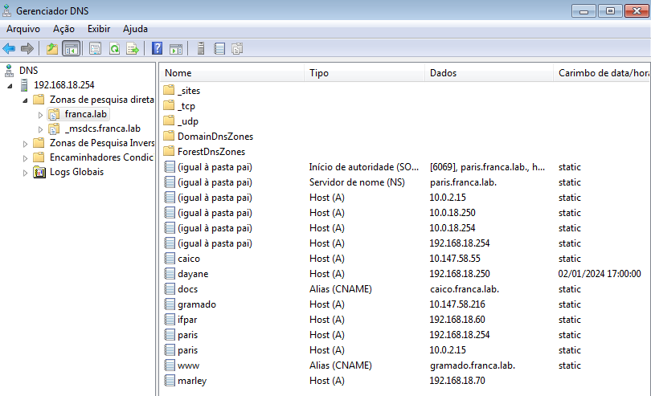
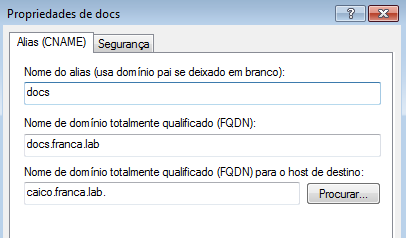

# DNS

O DNS converte nomes de domínio, como www.example.com, em endereços IP correspondentes, como 192.168.1.1. 

O DNS organiza os nomes de domínio em uma estrutura hierárquica, com domínios de nível superior (TLDs, como .com, .org) no topo, seguidos por domínios de segundo nível e assim por diante. 

## Instalação

Foi feita uma conexão por meio do samba entre um cliente Windows e um servidor Linux Alpine.

## Configuração

Incluir o(s) nome(s) e o conteúdo do(s) arquivo(s) de configuração.

Cinco registros (4 pontos cada):

- 3 do tipo A (Endereços);
- 2 do tipo CNAME (`www` e `docs`);

---------------------------------------------------------------------------------

Visão geral do Gerenciador de DNS

A máquina xarope de ip 192.168.18.254, está sendo utilizada como gateway e servidor dns para a máquina Windows.

### Registros do tipo A

### Registros do tipo CNAME

## Teste

Ping feito para os endereços tipo CNAME

Ping para os endereços tipo A

