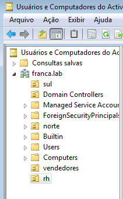
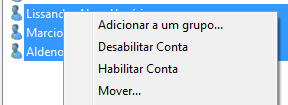
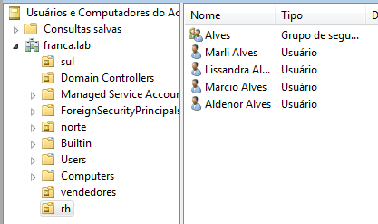
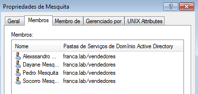
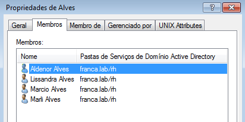

# LDAP

O LDAP é um protocolo de comunicação padrão utilizado para acessar e gerenciar serviços de diretório. Muitas aplicações, como servidores de e-mail, servidores de autenticação, serviços de diretórios corporativos, entre outros, podem integrar-se ao LDAP para acessar e gerenciar informações de diretório.

## Instalação

Esse serviço foi realizado utilizando o samba como base. Para instalar o samba o comando `apk add samba` é utilizado.

## Configuração

Incluir o(s) nome(s) e o conteúdo do(s) arquivo(s) de configuração.

- Criar duas OU: `vendedores` e `rh`;
- Mover o grupo `sobrenome1` e seus membros para a OU `vendedores`;
- Mover os grupo `sobrenome2` e seus membros para a OU `rh`.

-------------------------------------------------------------------

Criação das OUs "vendedores" e "rh".

A função "Mover..." permitiu tirar os usuários e o grupo da OU norte para as novas OUs rh e vendedores.

Sobrenome Alves e seus membros movidos para a OU rh.

Sobrenome Mesquita e seus membros movidos para a OU vendedores.

## Teste

