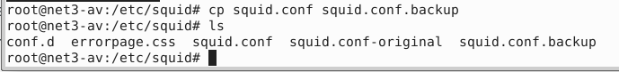
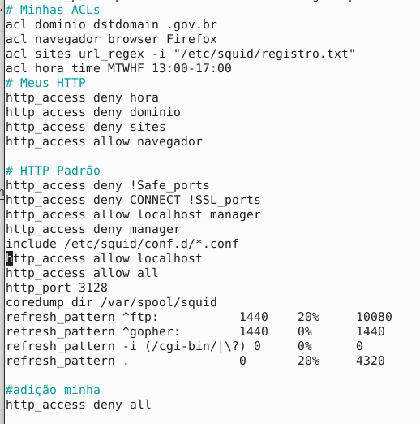
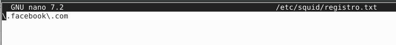
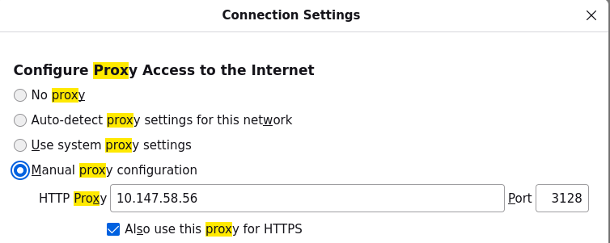
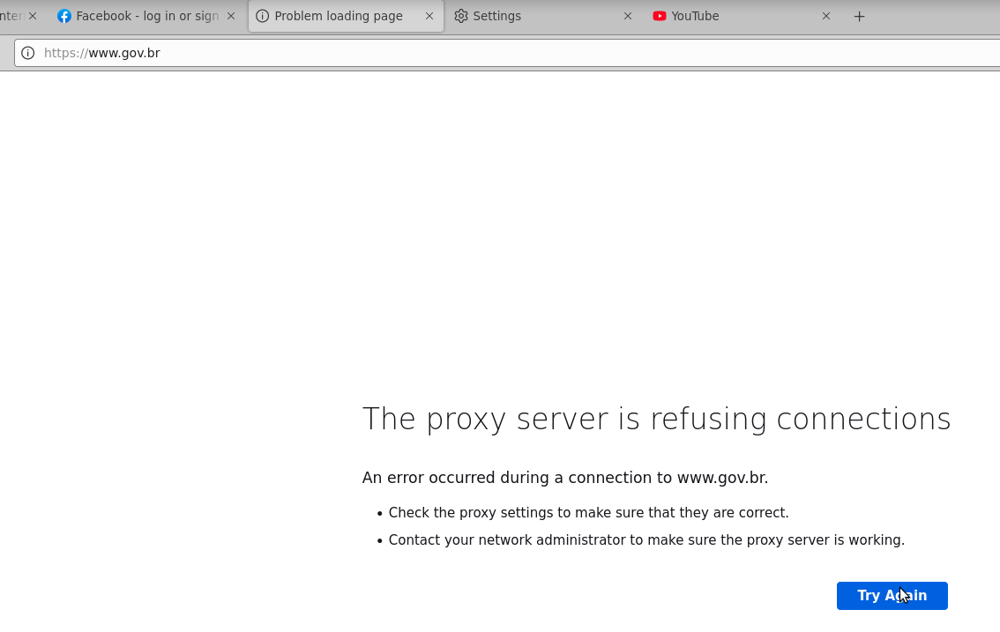
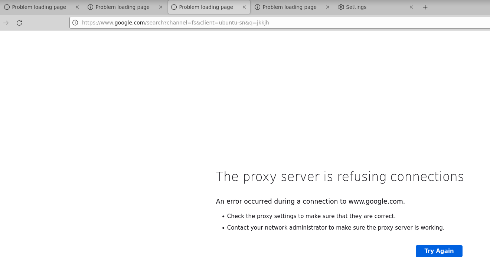
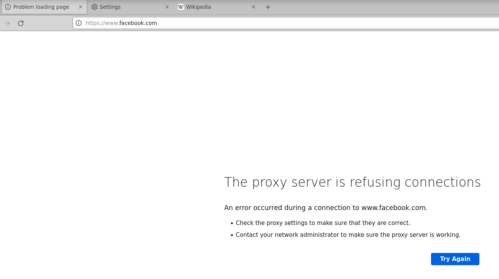
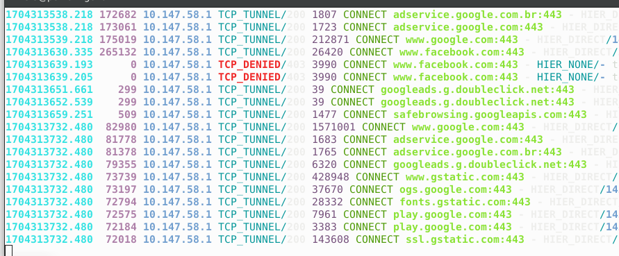

# PROXY

Um servidor proxy desempenha várias funções em uma rede, atuando como intermediário entre os clientes e os servidores. O servidor proxy pode ser configurado para impor políticas de controle de acesso, restringindo ou permitindo o acesso a determinados recursos da Internet.

## Instalação

O comando para instalar o proxy é `apt-get install squid`.

## Configuração

Incluir o(s) nome(s) e o conteúdo do(s) arquivo(s) de configuração.

Fazer a configuração de 4 ACLs distintas, conforme a atividade passada em sala de aula.

---------------------------------------------------------------------------------------
Os testes desse serviço foram realizados na máquina real.

Por segurança, uma cópia do arquivo `/squid.conf` foi criada, chamado de `/squid.conf.backup`.

Configuração das 4 ACLs do arquivo `/etc/squid/squid.conf`:

Para fazer a ACL do url_regex fiz a seguinte configuração no arquivo `registro.txt`:

Reiniciar o serviço Squid para aplicar as alterações com o comando `service squid restart`.

Configuração do Firefox para receber o serviço proxy com o IP da máquina real:

## Teste

### O domínio do gov.br foi bloqueado.

### O navegador Firefox foi bloqueado.

### Todos os sites foram bloqueados devido a hora.

### O facebook  foi bloqueado.

Registro dos arquivos de log:

