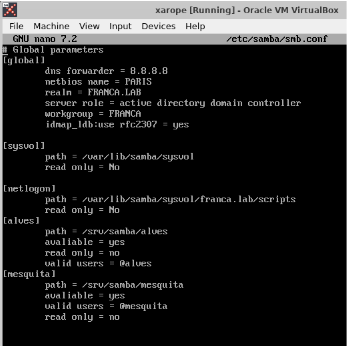

# SMB

O Samba permite que sistemas operacionais como Linux atuem como servidores ou clientes em uma rede que utiliza o protocolo SMB/CIFS, predominantemente associado a sistemas operacionais Windows.

## Instalação

Foi feita uma integração do Linux Alpine com o Windows 7. Realize o comando `apk add samba` para instalar o samba.

## Configuração

Incluir o(s) nome(s) e o conteúdo do(s) arquivo(s) de configuração.

1. Criar 2 grupos para dois de seus sobrenomes;
2. Criar 4 usuários, dois para cada um dos sobrenomes;
3. Compartilhar duas pastas com dois de seus sobrenome, compartilhado para o grupo com o sobrenome correspondente.
------------------------------------------------------------------------------------------------------------------

Criação da conta Administrador:

Configuração do domínio e atribução de IPv4:

Configuração do arquivo `/etc/samba/smb.conf`:

Criação de grupos e usuários:

Cada sobrenome está em um grupo diferente:

Cada grupo só consegue acessar a pasta na qual está inserido.

## Teste

Listando os 2 grupos criados através do terminal:

Listando os membros dos 2 grupos criados através do terminal:

